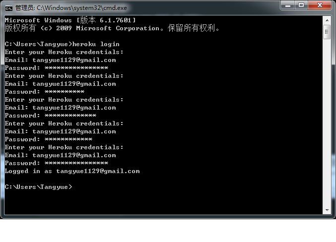
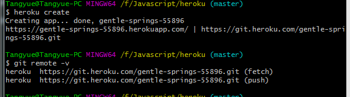
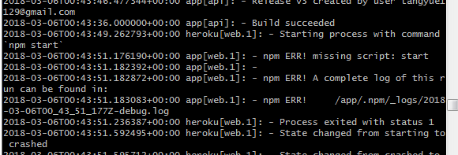
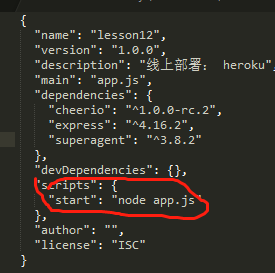
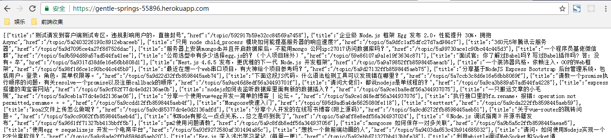

线上部署： heroku


#### IaaS , PasS , SaaS 的区别  -- 摘自阮一峰的总结

云服务的三大类，即Iass，Pass，SaaS。

从左到右，自己承担的工作量越来越少，IasS>PasS>SaaS

IaaS： 基础设施服务
PaaS：平台服务
SaaS：软件服务

SaaS是软件的开发、管理、部署都交给第三方，不需要关心技术问题，可以拿来即用。

PaaS 提供软件部署平台，抽象掉了硬件操作系统细节，可以无缝地扩展。开发者只需要关注自己的业务逻辑，不需要关注底层。

IasS是云服务的最底层，主要提供一些基础资源。

#### heroku 线上部署

heroku 主动提供一个环境变量process.env.PORT来供我们监听。以防止大家都监听5000端口会有冲突。

Procfile 是普通的文本文件，需要将其放到代码的跟目录中，其内容是定义如何将程序运行起来。 通常情况下
只包含一行信息即可。

##### 具体操作

新建文件夹 heroku
npm init 初始化

首先安装依赖。 express， cheerio， superagent。
新建app.js 文件    文件内容如下：
```
var express = require('express');

var cheerio = require('cheerio');

var superagent = require('superagent');

var app = express();

app.get('/', function(req, res, next) {
	superagent.get('https://cnodejs.org/')
		.end(function(err, sres) {
			if(err) {
				return next(err);
			}

			var $ = cheerio.load(sres.text);
			var items = [];

			$('#topic_list .topic_title').each(function(idx, element) {
				var $element = $(element);
				items.push({
					title: $element.attr('title'),
					href: $element.attr('href')
				});
			});
			res.send(items);
		});
});


app.listen(process.env.PORT || 5000);

// 下面是之前的lesson3 app.js 
// app.listen(3000, function(req, res) {
// 	console.log('app run in localhost:3000');
// })
```
新建 .Procfile 文件内容如下
```
web: node app.js
```
 heroku 注册 https://www.heroku.com/

 然后下载它的工具包  http://toolbelt.heroku.com 然后安装

 安装完成之后 打开终端cmd窗口，记住一定要是终端，而不是git bash。git 会出错。命令行为heroku login。
 出错信息为 `Login is currently incompatible with git bash/cygwin`  解决方案 参考https://stackoverflow.com/questions/34792563/login-is-currently-incompatible-with-git-bash-cygwin/34797965

 正确如图（因为好几次把密码给记错了，所以会让你一直输入密码。）

  

 接着
 
 输入命令 heroku create 会自动分配给你一个heroku仓库 （windows）如下图

 

 git init

 git remote -v

 heroku create

 git add .

 git commit -am 'u'

 git push heroku master

 heroku open 

 之后发现 执行 heroku open 并没有任何的反应

查看 heroku 记录  heroku logs 如下图




图中有个error 于是 打开 package.json  将原来位置的信息，修改成下图中红色部分，完美解决问题。



最后显示如下结果 如下图：




