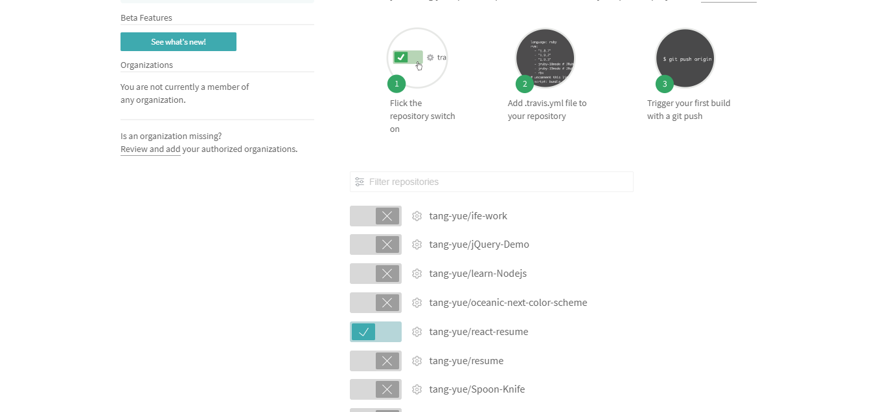
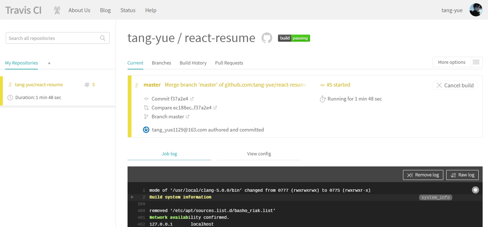

持续集成平台： travis  [网址](https://travis-ci.org/)


注册 travis  然后用直接用github登录， 你的公共仓库就会直接添加进去。
然后选择你想要测试的仓库。 如下图：




添加 .travis.yml 文件进你的仓库。  具体配置请参考官方文档。这个课程的配置现在会出现一些问题。
下面是我的配置

```
language: node_js
node_js:
 - '6.11.2'
```
之后 git push 之后就会自动帮你测试 如图

最后测试通过的图标。


行覆盖率的那个badge是由一个叫coveralls（https://coveralls.io）的服务提供的，自己可以尝试着接入。

如果你的应用有使用到数据库，需要在.travis.yml 中添加一些内容。

以MongoDB为例：
```
	services:
		mongodb
```
具体数据库详细内容参考[官方文档](https://docs.travis-ci.com/)


